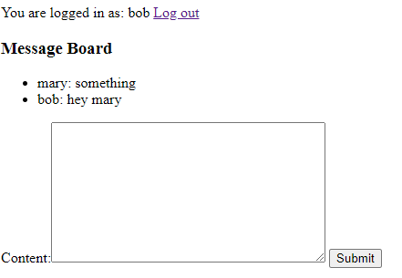
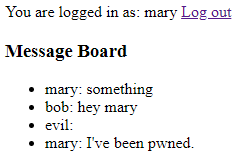

# cookie-xss

Example of how XSS attacks can bypass even traditional cookie authentication with adequate CSRF protection.

This was produced to support my argument in https://github.com/OWASP/CheatSheetSeries/issues/375.

## Introduction

This repo contains a traditional server-rendered Django application:

- Authentication requests is done via the `sessionid` cookie, which is `HttpOnly` and has `Same-Site: Strict`.
- The site is [protected against CSRF attacks](https://docs.djangoproject.com/en/3.1/ref/csrf/#module-django.middleware.csrf)
  using a server-generated `csrftoken` cookie, which must match the value of the `csrfmiddlewaretoken` hidden form field (also server-generated) for POST requests.

The application has two pages:

1. A login/register page at `/login`.
   For the sake of simplicity, registration is unnecessary and you can login as any user.
   If the username doesn't exist yet, it is automatically created.
   This is obviously a vulnerability, but it's not exploited for the purposes of this demo.
2. The home page at `/`, which is like a discussion board: it lists messages posted by all users, and also allows you to submit a new message.
   This page requires authentication, and redirects to `/login` for unauthenticated requests.

The XSS vulnerability was deliberately introduced by marking the message content as safe in the HTML template for the home page:

```html
<!-- main/templates/index.html -->
<li>{{ post.user.username }}: {{ post.content|safe }}</li>
```

This is a textbook example of a XSS vulnerability: [inserting untrusted data into the HTML content without escaping it](https://cheatsheetseries.owasp.org/cheatsheets/Cross_Site_Scripting_Prevention_Cheat_Sheet.html#rule-1-html-encode-before-inserting-untrusted-data-into-html-element-content).

Note that the vulnerability is not related to the authentication mechanism whatsoever.
It's also not specific to Django, or even server-rendered pages.

## Setup

1. Create a virtual environment and install the requirements.

```console
$ python -m venv venv
$ venv/bin/pip install -r requirements.txt
```

2. Run the migrations.

```console
$ venv/bin/python manage.py migrate
```

3. Finally, run the server:

```console
$ venv/bin/python manage.py runserver
```

## A Quick Tour

You should now be able to navigate to `http://localhost:8000`, which initially brings you to the login page:


Enter `mary` as the Username, and hit "login".
You're now brought to the (empty) discussion board.


Enter something in the text box, and hit "Submit".


Now hit "Log out", and repeat the procedure as the user `bob`.



Simple enough.

You can reset the database at any time by stopping the server, deleting `db.sqlite3`, and running `python manage.py migrate` and `python mangage.py runserver` again.

## XSS (Stored) Attack

Let's now see how we can exploit the XSS vulnerability.
The idea is to submit malicious Javascript code as HTML in the input box, which will be executed automatically by the browser for anyone viewing the message board.

The `attacks` directory in this repo contains various `.html` files.
They all exploit the same vulnerability, but work in slightly different ways, just to show how easy it is to do anything on a victim's behalf once you can run arbitrary Javascript from their browser.
You can copy the contents of any one of them, login as, say, `evil`, and post it on the discussion board.
In order to not "attack yourself", you can turn off Javascript when logged in as `evil`, and turn it back on when you login as the victims.
In the end, you should be able to see something like this:



Of course, users who disable Javascript are not vulnerable to XSS attacks!
Unfortunately, with the rising popularity of single-page apps, disabling Javascript is not really an option nowadays.

The rest of this section discusses the differences between the various attacks.

### dom.html

This is the simplest one, and takes advantage of the fact that the form to submit a new message is on the same page as the message board _and_ that the application relies on standard browser behaviour to submit the form, as opposed to an AJAX call.
It simply enters text in the `textarea` element, and clicks the "Submit" button.
The browser then submits the POST request, as dictated by the `form`'s attributes.
Additionally, because the response to the POST request redirects to the same page, the malicious code is executed once more, and the cycle continues _ad vitam aeternam_ -- or until you close the tab/window.

### fetch_csrf-from-current-page.html

This pulls the CSRF token from the DOM, and submits the POST request with `fetch` -- the same kind of POST request that the browser would send when hitting "Submit".
Similarly to the previous attack, this relies on the fact that the form is on the same page as the message board.

### fetch_csrf-from-other-page.html

Suppose that the home page didn't contain a form, and you instead had to click on some "New Message" button, which then brings you to a page where you can enter a new message and hit "Submit".
This attack shows you could still:

- Submit a GET request to that page with `fetch` -- in this case it's the same page.
- Parse the HTML response to grab the CSRF token from the hidden input field.
- Submit a POST request, similarly to the previous attack, using that CSRF token and the desired text.
